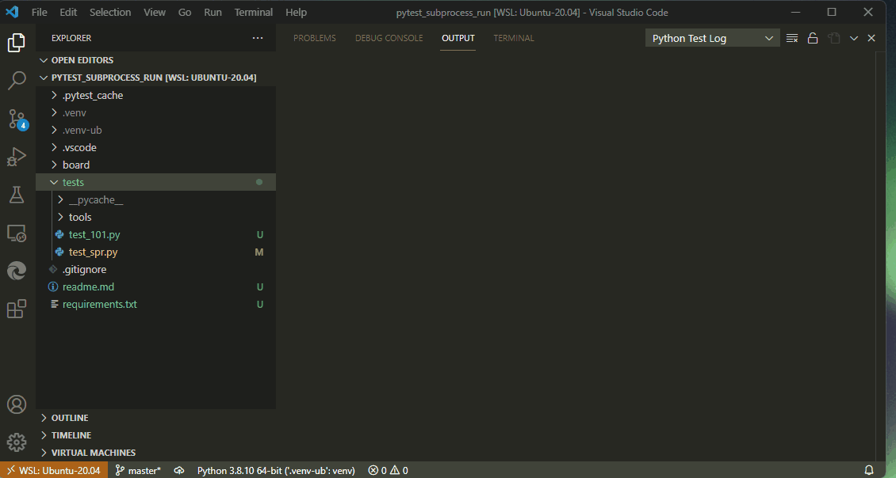

# Repro of VSCode Python bug

Steps : 
- create folder with basic structure

```
+---.venv       (windows) 
+---.venv-ub    (ubuntu in WSL) 
+---.vscode
+---board
\---tests
    +---tools
```

create a windows venv .venv using
``` powershell
python -m venv .venv
```
create a linux  venv .venv-ub using
``` bash
python3 -m venv .venv-ub 

```

- configure tests, 
  - select pytest 
  - select the tests folder 

  - allow python to install pytest 

- create two tests 
    [tests/test_101.py][] just as a sanity check
    [tests/test_spr.py][] show bug 

## Expected : 
 [ ] pytest to run both tests sucesfully 
 [ ] vscode python testing to run both tests sucessfully 
 [ ] vscode to be able to debug  both tests sucessfully 
 
## Actual 
 [x] pytest to run both tests sucesfully 
 [x] vscode python testing to run both tests sucessfully 
    [x] tests/test_101.py
    [x] tests/test_spr.py

 [ ] vscode to be able to debug  both tests sucessfully 
    [x] tests/test_101.py
    [ ] **tests/test_spr.py** subprocess.run Fails while debugging with the below error:  

```
Traceback (most recent call last):
  File "/home/jos/.vscode-server/extensions/ms-python.python-2021.11.1422169775/pythonFiles/lib/python/debugpy/_vendored/pydevd/pydevd.py", line 24, in <module>
  File "/home/jos/.vscode-server/extensions/ms-python.python-2021.11.1422169775/pythonFiles/lib/python/debugpy/_vendored/pydevd/_pydevd_bundle/pydevd_constants.py", line 4, in <module>
ImportError: no module named \'__future__\'\
```




# versions  
- Python ext - v2021.11.1422169775

- ubuntu 20.04 on WSL2 on Winmdows 11 
- Python3 3.8.10
- VSCode 

for module versions see [requirements.txt][]

```
Version: 1.62.1 (user setup)
Commit: f4af3cbf5a99787542e2a30fe1fd37cd644cc31f
Date: 2021-11-05T10:57:55.946Z
Electron: 13.5.2
Chrome: 91.0.4472.164
Node.js: 14.16.0
V8: 9.1.269.39-electron.0
OS: Windows_NT x64 10.0.22000
```  